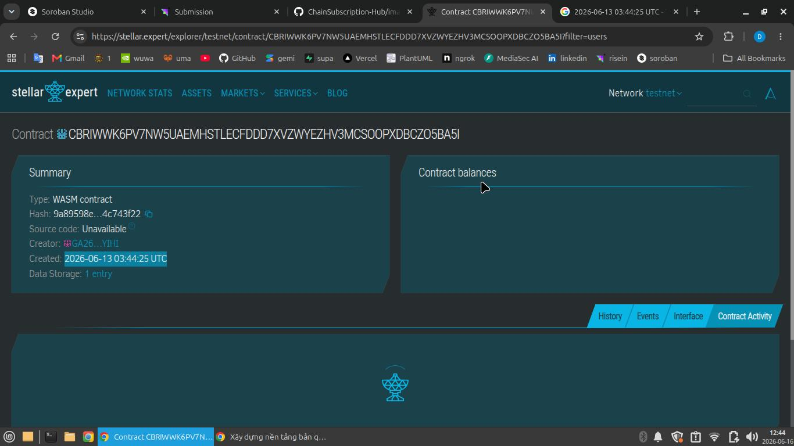

# YourCopyright

## Project Title
YourCopyright

## Project Description
YourCopyright is a decentralized smart contract built on the Stellar blockchain using the Soroban SDK. It serves as an immutable registry for intellectual property, allowing creators to digitally mint, protect, and verify ownership of various digital assets such as Books, Music, Artwork, and Source Code securely and trustlessly.

## Project Vision
The vision of YourCopyright is to offer creators, authors, and developers a decentralized, secure, and automated way to register and protect their intellectual property without relying on centralized copyright agencies. This guarantees transparent ownership enforcement, preventing plagiarism and increasing trust in digital asset distribution.

## Key Features
- **Multi-Asset Registration:** Protect any digital asset class including books, art, music, video, and code.
- **Cryptographic Fingerprinting:** Links assets to their original files using SHA-256 hashes (`file_hash`), ensuring content cannot be altered.
- **Immutable Ownership:** Permanently binds a unique Asset ID to the creator's wallet address.
- **Anti-Overwrite Protection:** Built-in safeguards prevent malicious users from overriding existing asset IDs.
- **On-Chain Transparency:** Anyone can query the contract to verify the true owner and metadata of an asset.

## Usage Instructions
1. **Set Up Account:** Connect a Stellar wallet to interact with the contract.
2. **Prepare Metadata:** Generate a cryptographic hash (SHA-256) of your digital asset file.
3. **Register Asset:** Use the `register_asset` function to mint a new digital copyright record linked to your wallet address.
4. **Verify Ownership:** Use the `get_owner` function to check the legal owner of a specific asset ID.
5. **Query Info:** Use the `get_asset_info` function to retrieve the public metadata of a registered asset.

## Future Scope
- **Ownership Transfer:** Allow creators to securely transfer or sell the copyright of their digital assets.
- **Licensing & Royalties:** Integrate automated royalty payments using Soroban tokens for asset usage.
- **Decentralized Storage Integration:** Direct integration with IPFS or Arweave for fully decentralized off-chain metadata storage.
- **User Dashboards:** Build an intuitive web frontend for creators to manage their intellectual property portfolios.
- **Dispute Resolution:** Add mechanisms for community-driven or oracle-based IP dispute resolution.

## Technology Stack
- Rust and Soroban SDK for secure smart contract development.
- Stellar blockchain for decentralized, immutable state management.
- Cryptographic fingerprinting and timestamping for secure digital asset protection.

## Contribution
Community contributions are welcomed from blockchain developers and intellectual property experts. Fork and submit pull requests to assist in further development.

## License
This project is licensed under the MIT License.

### Contract Detail
ID: CBRIWWK6PV7NW5UAEMHSTLECFDDD7XVZWYEZHV3MCSOOPXDBCZO5BA5I
